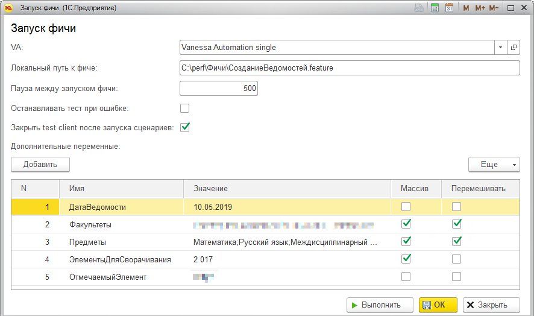

# tc-epf-template

Шаблон тестовой обработки для 1С:Тест-центр и Vanessa Automation.

Используется для цикличного запуска файла фичи в Vanessa Automation, подключенной в справочник "Дополнительные отчеты и обработки" (поставка Vanessa Automation Single).

Доклад про нагрузочное тестирование с помощью данной обработки: https://infostart.ru/1c/articles/1182048/



## Возможности и особенности

* Добавлены функции:
  * ТЦПарольПользователя
  * ТЦПауза
  * ТЦУникальныйНомерВРМ
* Открытие и конфигурирование формы Vanessa Automation в шаге `ТЦИнициализировать`
* Автоматический расчет диапазона портов для запуска нескольких ВРМ и экземпляров Vanessa Automation на одном Агенте
* Табличная часть для хранения дополнительных параметров сценария/роли
* Возможность авторазбития значения параметра-строки в массив, используя разделитель "точка с запятой". Возможность перемешивания полученного массива 
* Перенос "Дополнительных параметров" в `КонтекстСохраняемый` для последующего использования в фичах
* Асинхронное выполнение теста - возврат `ТЦРезультатВыполненияПродолжить` в шаге `ТЦВыполнить`
* Повторный запуск сценария (после паузы) после завершения или падения сценария
* Очистка кэша замеров подсистемы "Оценка производительности" при завершении/падении сценария. Проверено на БСП 2.2, 2.3 и 3.0

## Включение замеров БСП 3.0

В репозитории содержится файл Замеры.feature, в котором представлены сценарии для начала и окончания замеров времени через подсистему "Оценка производительности", входящую в состав БСП. 

Имя/ссылка на ключевую операцию берется из `КонтекстСохраняемый` Vanessa Automation. Самый простой способ поместить туда нужную ключевую операцию - использовать таблицу `Дополнительные параметры` в шаблоне роли "ТЦЗапускФичи". Имя параметра для получения ключевой операции по умолчанию - `КлючеваяОперация`.

В фичах замеров используется API БСП 3.0.

## Включение замеров БСП 2.2

Для БСП 2.2 необходимо изменить произвольный код в фичах вызов следующим образом:

Начало замера:

```feature
        Тогда я выполняю код встроенного языка
        | 'ОценкаПроизводительностиКлиентСервер.НачатьЗамерВремени(КонтекстСохраняемый.КлючеваяОперация);'         |
        | 'РегламентныеЗаданияСлужебныйКлиент.ОтключитьГлобальныйОбработчикОжидания("ЗакончитьЗамерВремениАвто");' |
```

Окончание замера:

```feature
        Тогда я выполняю код встроенного языка
        | 'ОценкаПроизводительностиКлиент.ЗакончитьЗамерВремениАвтоНеГлобальный();' |
        | 'ОценкаПроизводительностиКлиент.ЗаписатьРезультатыАвтоНеГлобальный();'    |
```
